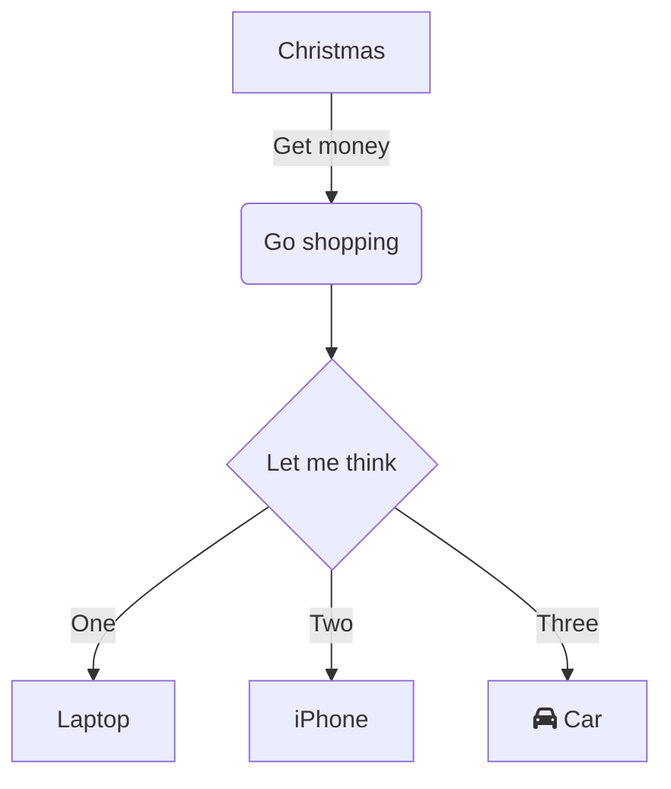
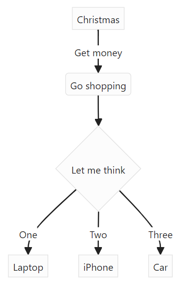

[000Index](../000Index.md)
# VIM Learning note
#vim
## Table of Contents
- [Questions](\#questions)
- [Introduction](\#introduction)
- [Modes](\#modes)
- [Movement](\#movement)
- [Command](\#command)
- [Plugin](\#plugin)
- [Script](\#script)
- [Customization](\#customization)
- [Flow sample](\#flow-sample)
- [Practice](\#practice)

## Questions

## Introduction
VIM is a powerful text editor with modal functionality, designed for efficient text editing. This document will serve as a personal guide to mastering VIM step by step and future reference.
Reference: [Vim实用技巧](assets/Vim_info/Vim实用技巧（第2版）.pdf)
Vim解决问题的方式是对重复性操作进行了优化。它之所以能高效地重复，是因为它
会记录我们最近的操作，让我们用一次按键就能重复上次的修改。这听
起来很强大，但是除非我们能够学会规划按键动作，使得在重复时能完
成一项有用的工作，否则这没什么用。掌握这一理念是高效使用Vim的
关键。
## Modes
- `Esc` ::: Key to access to **Normal Mode**
- `i` ::: Key to access to **Insert Mode**
- `v` ::: Key to access to **Visual Mode**
- `:` ::: Key to access to **Command Mode**

## Movement
All commands in this section should be press in normal mode.

### Exiting
- `ZZ` ::: Save and quit
- `ZQ` ::: Quit without checking changes
<!--SR:!2000-01-01,1,250!2024-12-31,1,222-->
### Cursor Movement  
- `h` ::: Move cursor left.  
- `j` ::: Move cursor down.  
- `k` ::: Move cursor up.  
- `l` ::: Move cursor right.  
- `gj` ::: Move cursor down (across wrapped lines).  
- `gk` ::: Move cursor up (across wrapped lines).  
- `H` ::: Move to the top of the screen.  
- `M` ::: Move to the middle of the screen.  
- `L` ::: Move to the bottom of the screen.  
- `w` ::: Jump forward to the start of a word.  
- `W` ::: Jump forward to the start of a word (including punctuation).  
- `e` ::: Jump forward to the end of a word.  
- `E` ::: Jump forward to the end of a word (including punctuation).  
- `b` ::: Jump backward to the start of a word.  
- `B` ::: Jump backward to the start of a word (including punctuation).  
- `ge` ::: Jump backward to the end of a word.  
- `gE` ::: Jump backward to the end of a word (including punctuation).  
- `%` ::: Move to a matching character (default pairs: `'()'`, `'{}'`, `'[]'`).  
- `0` ::: Jump to the beginning of the line.  
- `^` ::: Jump to the first non-blank character of the line.  
- `$` ::: Jump to the end of the line.  
- `g_` ::: Jump to the last non-blank character of the line.  
- `gg` ::: Go to the first line of the document.  
- `G` ::: Go to the last line of the document.  
- `5gg` or `5G` ::: Go to the 5th line.  
- `gd` ::: Move to a local declaration.  
- `gD` ::: Move to a global declaration.  

### Insert Mode - Insert/Appending Text  
- `i` ::: Insert before the cursor.  
- `I` ::: Insert at the beginning of the line.  
- `a` ::: Append after the cursor.  
- `A` ::: Append at the end of the line.  
- `o` ::: Open a new line below the current line.  
- `O` ::: Open a new line above the current line.  

### Editing  
- `r` ::: Replace a single character.  
- `R` ::: Replace multiple characters until `<Esc>` is pressed.  
- `J` ::: Join the next line with the current line, adding a space.  
- `gJ` ::: Join the next line with the current line, without adding a space.  
- `cc` ::: Change (replace) an entire line.  
- `c$` or `C` ::: Change (replace) to the end of the line.  
- `ciw` ::: Change (replace) the entire word.  
- `cw` or `ce` ::: Change (replace) to the end of the word.  
- `u` ::: Undo.  
- `U` ::: Undo changes to the entire line.  
- `.` ::: Repeat the last command.  

### Visual Mode  
- `v` ::: Enter visual mode and select text.  
- `V` ::: Enter visual line mode.  
- `<Ctrl> + v` ::: Enter visual block mode.  
- `aw` ::: Select a word.  
- `ab` ::: Select a block with `()`.  
- `aB` ::: Select a block with `{}`.  
- `at` ::: Select a block with `<>`.  
- `ib` ::: Select inside `()`.  
- `iB` ::: Select inside `{}`.  
- `it` ::: Select inside `<>`.  

### Copy and Paste  
- `yy` ::: Yank (copy) a line.  
- `2yy` ::: Yank 2 lines.  
- `yw` ::: Yank from the cursor to the start of the next word.  
- `yiw` ::: Yank the word under the cursor.  
- `yaw` ::: Yank the word under the cursor and surrounding spaces.  
- `y$` or `Y` ::: Yank to the end of the line.  
- `p` ::: Paste after the cursor.  
- `P` ::: Paste before the cursor.  
- `gp` ::: Paste after and leave the cursor at the end of the pasted text.  
- `gP` ::: Paste before and leave the cursor at the end of the pasted text.  
- `dd` ::: Delete (cut) a line.  
- `2dd` ::: Delete 2 lines.  
- `dw` ::: Delete from the cursor to the start of the next word.  
- `diw` ::: Delete the word under the cursor.  
- `daw` ::: Delete the word under the cursor and surrounding spaces.  
- `d$` or `D` ::: Delete to the end of the line.  

### Exiting  
- `:w` ::: Write (save) the file without exiting.  
- `:wq` or `:x` or `ZZ` ::: Write (save) and exit.  
- `:q` ::: Quit (fails if there are unsaved changes).  
- `:q!` or `ZQ` ::: Quit and discard unsaved changes.  

Let me know if you'd like more sections translated!
### Misc
- `.` ::: Repeat the last action in normal mode or all input from i to Esc. This is Mini Macro.
- `Ctrl+W+W`:::Switch between Vim window splits 
<!--SR:!2025-01-06,8,250!2025-01-18,20,250-->
- `Ctrl + F`::: Page down, moving Forward
<!--SR:!2025-01-03,5,230!2025-01-05,7,250-->
- `Ctrl + B` ::: page up, moving Backward
<!--SR:!2025-01-01,2,210!2025-01-01,3,210-->
- `gt` ::: To switch between tabs you can use
<!--SR:!2025-01-07,9,250!2000-01-01,1,250-->
- `Ctrl+ ]` ::: Jump to a subject
- `Ctrl + T / O` ::: Jump back to previous position
- `#x` ::: Delete \# character
<!--SR:!2024-12-31,1,205!2000-01-01,1,250-->
- `#dw` ::: Delete \# word
- `$`  ::: move to the end of line, INCLUDING the last character.
<!--SR:!2025-01-01,2,242!2000-01-01,1,250-->
- `d$`  ::: delete to the end of the line
<!--SR:!2000-01-01,1,250!2025-01-01,2,242-->
- `de /w` ::: delete word
<!--SR:!2024-12-31,1,222!2000-01-01,1,250-->
- `Ctrl + R` ::: Redo
<!--SR:!2000-01-01,1,250!2024-12-31,1,222-->
- `Ctrl + r` ::: Redo 
- `N` ::: backward next; previous next
<!--SR:!2000-01-01,1,250!2025-01-01,2,242-->
- `w` ::: move to begin of next word
<!--SR:!2024-12-31,2,245!2025-01-03,5,246-->
- `b` ::: begin of previours word, word begin
-  `e` ::: to the end of the current word, word end, INCLUDING the last character.
<!--SR:!2000-01-01,1,250!2025-01-01,2,242-->
- `^` ::: Go to the beginning of the line and after whitespace.
- `0` ::: Go to the beginning of the line
<!--SR:!2000-01-01,1,250!2025-01-01,2,242-->
- `"+p` :::  to paste from clipboard.
<!--SR:!2000-01-01,1,250!2024-12-31,1,222-->
- `"*y` :::  to copy to system clipboard.
- `qa` ::: begin to record the macro
- `q`  ::: stop to record the macro
<!--SR:!2025-01-03,5,246!2025-01-10,12,246-->
- `J`  ::: Uppercase J will join that line and the next line

## Command
### Search & Replace
- `:s/\s/\r/g` ::: Find space replace with line break

### Misc
- `:normal {command}` ::: Excute a normal mode command [^2]
- `:'<,'>{command}` ::: The command only apply on selected area.[^2]
- `:%{command}` ::: The command apply on whole document [^3]
- `:ter` ::: Open a terminal / shell inside VIM
<!--SR:!2025-01-01,2,242!2025-01-01,2,242-->
- `:vertical botright term` ::: Open a terminal vertically at the right side of the window
<!--SR:!2025-01-01,2,242!2024-12-31,1,222-->
- `:tabnew` ::: You can open a new tab with the command. Practice[^1]
- `:tabnew [filename]` ::: You can open a new tab with the command
<!--SR:!2000-01-01,1,250!2024-12-31,1,222-->
- `:q<Enter>` ::: Close this window
- `:qa!<Enter>` ::: Get out of Vim
<!--SR:!2024-12-31,2,226!2024-12-31,2,245-->
- `:reg<Enter>` ::: Show yank register
- `:register<Enter>` ::: Show yank register
<!--SR:!2024-12-31,1,222!2000-01-01,1,250-->
- `:cd mydirectory` ::: Set working / current directory in Vim
- `:ter` ::: Open a terminal / shell inside VIM
<!--SR:!2024-12-31,2,242!2000-01-01,1,250-->
- `:vertical botright term` ::: Open a terminal vertically at the right side of the window
- `:tabnew` ::: You can open a new tab with the command
- `:tabnew [filename]` ::: You can open a new tab with the command
- `:q<Enter>` ::: Close this window
- `:qa!<Enter>` ::: Get out of Vim
<!--SR:!2024-12-31,2,226!2024-12-31,2,245-->
- `:reg<Enter>` ::: Show yank register
<!--SR:!2000-01-01,1,250!2024-12-30,1,222-->
- `:register<Enter>` ::: Show yank register
- `:cd mydirectory` ::: Set working / current directory in Vim

## Plugin

## Script

## Customization

## Flow-sample

## Practice
[^1]: Open abc.txt in a new tab: `:tabnew abc.txt`
[^2]: Repeat the last command on selected area: `:'<,'>normal .`
[^3]: Add ; at the end of each line in the whole document: `:%normal A;`
